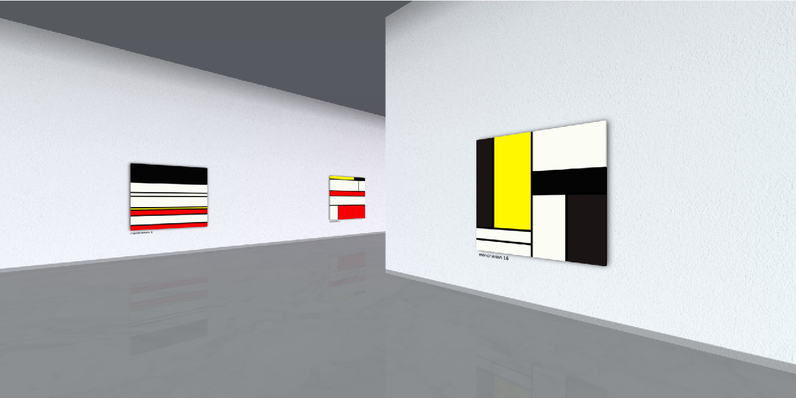

# [Virtual Art Gallery](https://robmeyer.github.io/virtual-art-gallery/build)

[](https://robmeyer.github.io/virtual-art-gallery/build)

## Description

This project simulates an art gallery in your browser using [REGL](https://github.com/regl-project/regl).
It aims at reproducing the experience of a real art gallery.
The architecture is generated using a 10km long 6th order [Hilbert Curve](https://en.wikipedia.org/wiki/Hilbert_curve).

The paintings are asynchronously loaded from local images contained under `images/`. `npm build` will run `images/generateList.js` as a prebuild step to update `images/images.json`, which gets embedded directly within `build.html` through a require statement during build time.

Alternatively, another option is to dynamically fetch paintings using the [ARTIC](https://api.artic.edu) api. This can be configured under `api.js` by changing `default: "local",` to `default: "arctic",`.

## Setup

Installation :
```shell
git clone https://github.com/robmeyer/virtual-art-gallery.git
npm install
```
Start the budo dev server : 
```shell
npm start
```
Build : 
```shell
npm build
```
